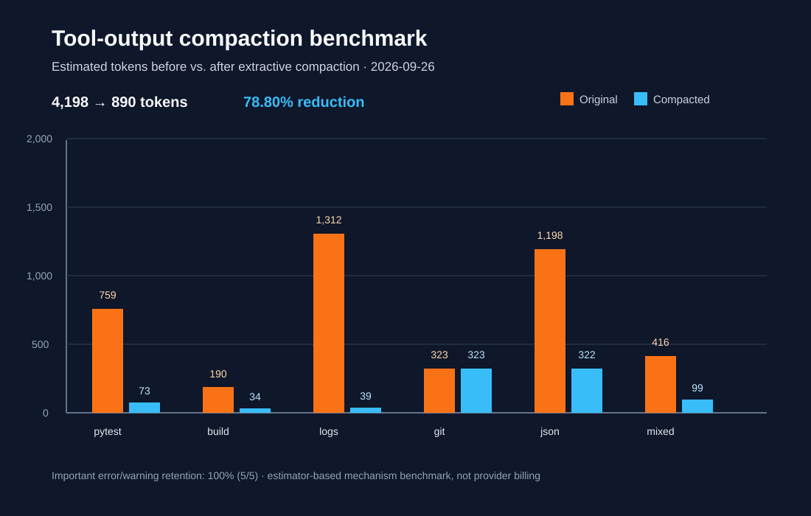

# Codex Elastic Budget Controller

[简体中文](README.zh-CN.md)

An experimental local helper that gives short tasks a smaller budget and long, tool-heavy conversations more context. It periodically adjusts Codex's context window and compaction point, while an optional request wrapper supports immediate feedback learning.

> This is an independent experiment, not an official OpenAI feature.

## Quick install on a new computer

Requires Python 3 and Git on macOS or a systemd-based Linux distribution.

```bash
git clone https://github.com/wzs2004/codex-elastic-budget-controller.git
cd codex-elastic-budget-controller
./scripts/install.sh --fresh-state
```

The installer backs up existing files, installs a 120-second background schedule, and runs the controller once. Start a **new Codex conversation** afterward so it uses the newly selected context window.

Update without deleting learned state:

```bash
git pull
./scripts/install.sh
```

Check status or uninstall:

```bash
./scripts/status.sh
./scripts/uninstall.sh
```

## What works automatically

| Capability | After installation |
|---|---|
| Adjust Codex context window and compaction point | Automatic |
| Periodically select a capacity profile from local session signals | Automatic |
| Per-request filtering and immediate feedback learning | Requires `--execute-request` integration |

The external controller cannot silently intercept every request made by the standard Codex client. The advanced request planner becomes effective only when an upstream worker applies its plan.

## What it adjusts

- `model_context_window`
- `model_auto_compact_token_limit`
- `model_reasoning_effort`
- `model_verbosity`
- `model_reasoning_summary`

It deliberately leaves the model, provider, service tier, permissions, and tools unchanged.

## Strategy

The controller combines:

- per-request preflight planning across reasoning, output, context selection, compression, and cache policy;
- automatic post-request feedback and a confidence-guarded full-covariance LinUCB learner with tier-local drift decay;
- query-aware extractive context selection with protected boundaries;
- stable-prefix/dynamic-suffix prompt layout hints for cache reuse;
- quality/failure cascade fallback, enabled only by explicit request opt-in;
- quality, failure-rate, and latency guardrails plus IPS/SNIPS/DR evaluation;
- deterministic tool-output compaction that preserves actionable errors and can archive exact originals;
- four capacity profiles from economy through extended;
- an elastic compaction threshold with reserve and quantization limits;
- hysteresis, cooldowns, legacy-session isolation, and one profile change per session;
- repeat-compaction escalation;
- per-session strategy attribution;
- UCB exploration/exploitation using normalized cost, latency, failures, forgetting signals, completion, and compaction feedback.

Concurrent sessions are handled conservatively: a recent preferred session is not displaced merely because another JSONL file has a newer modification time. Learning occurs only after a completed session becomes stale.

## Run

```bash
python3 ~/.codex/elastic-budget-controller.py --force --verbose
```

For periodic execution, use your platform scheduler. The controller writes config and state atomically and is designed to be idempotent.

### Compact noisy tool output

Pipe command/test output through the built-in extractive compactor. It strips ANSI, folds consecutive duplicates, prioritizes errors and the tail, and can archive the byte-for-byte original for recovery:

```bash
pytest -q 2>&1 | python3 elastic-budget-controller.py --shrink-output \
  --shrink-max-lines 160 --shrink-archive-dir ~/.codex/elastic-output
```

Wrapped requests also expose `stdout_compact`, `stderr_compact`, and compression statistics. Set `output_archive_dir` in the request to retain exact originals. This is deliberately extractive rather than a lossy semantic summary.

`--execute-request` exports the selected plan as `ELASTIC_BUDGET_PLAN`, parses the worker's final JSON line, updates the learner immediately, and appends a decision/propensity/outcome record beside the state file for offline evaluation.

When `context_segments` are supplied, the plan contains the selected segments and a cache-friendly layout. The worker must apply that plan when assembling the model request. Set `"enable_cascade": true` only when an extra fallback call and its cost are acceptable.

## Test

```bash
python3 test_elastic_budget_controller.py
python3 test_off_policy_eval.py
python3 benchmarks/benchmark_output_compaction.py
python3 benchmarks/run_ab.py --help
```

See [`benchmarks/README.zh-CN.md`](benchmarks/README.zh-CN.md) for the reproducible paired A/B methodology, raw evidence format, limitations, and results.

### Current benchmark evidence



- [Output-compaction experiment report (Chinese)](benchmarks/OUTPUT_COMPACTION_EXPERIMENT.zh-CN.md)
- Six fixed tool-output cases: estimated tokens fell from **4,198 to 890 (78.80%)**.
- Important error/warning lines retained: **100% (5/5)**.
- This is an extractive mechanism benchmark using the repository estimator; it is not provider billing and makes no model-quality claim.

## Safety notes

- Back up `~/.codex/config.toml` before first use.
- Treat the supplied policy as an experimental baseline, not a universal optimum.
- Session logs remain local; this repository contains no logs, state, credentials, or personal configuration.
- Config keys may change across Codex versions. Validate against current official documentation before deployment.

## License

MIT
