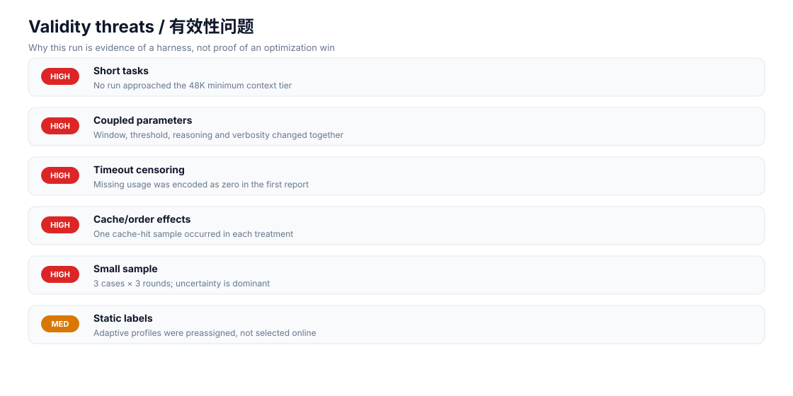

# 实验暴露的问题、原因与改进方案

## 结论先行

2026-09-25 的 18 次运行证明了配对执行、原始事件保存和自动评分链路可以工作，但不能证明弹性压缩策略有效。三个任务的输入都远低于最小 48K 上下文档位，没有触发压缩；同时修改上下文、压缩阈值、推理强度、详细度和摘要，使得任何变化都无法归因到单一参数。

这也暴露出原始定义过窄：弹性不应只在长上下文压力出现时才工作。v1.2 将其拆成“每请求预算”和“长上下文保护”两条控制环；研究依据与闭环设计见 [Token 效率研究与闭环学习方案](TOKEN_EFFICIENCY_RESEARCH.zh-CN.md)。

## 数据重新解读

- 两组各 9 次，均为 8 次完成、1 次 120 秒超时，质量均值均为 0.8889。
- 只看完成样本：baseline/adaptive 平均 token 为 14,325.5/14,651.5，成本代理值为 13,489.1/13,742.4，延迟为 17.31/21.27 秒。
- 七个双方都完成的配对中，adaptive-baseline 的 token 中位差为 -2，成本代理中位差为 -40，延迟中位差为 +0.954 秒；均值容易被极端缓存/延迟样本推动。
- 缓存命中只出现在 `constraint_reasoning-r1-adaptive` 与 `structured_analysis-r1-baseline`，因此原始成本代理值既反映策略，也反映运行顺序和共享缓存状态。
- 原汇总把超时产生的缺失 usage 当作 0 token/0 成本，这会奖励失败。生成器已经改为：质量保留失败惩罚，资源均值只统计完成样本，并单列完成数和超时数。

## 为什么出现这些问题

### 1. 任务没有激活被测机制

短算术和短结构化输出不能测试 48K–128K 上下文、压缩时机或重复压缩保护。OpenAI 的评测最佳实践强调数据集应包含真实分布、边界案例和对抗案例；当前集合缺少长会话、工具密集、上下文增长和遗忘探针。

**修复：** 构造 16K/32K/48K/64K/96K/120K 分层长度，加入多轮事实回忆、跨段依赖、工具结果累积和重复压缩场景。每一层设置可自动评分的“针”与状态一致性检查。

### 2. 同时调整多个变量，无法识别因果

economy/standard/extended 同时改变五个参数。extended 的高推理强度可能增加延迟，economy 的低推理强度可能减少输出 token；这与压缩阈值本身混在一起。

**修复：** 先做消融实验：每次只改变一个因素；随后使用分数因子设计或响应面设计估计交互项。把“容量档位”和“推理预算”拆成两个独立动作维度，学习器使用受约束的分层决策。

### 3. 超时是删失数据，不是零成本

进程在 120 秒被终止时没有 `turn.completed` usage。把缺失值写成 0 会让失败策略显得更便宜，也会扭曲 pairwise 排名。

**修复：** 资源指标使用完成样本并报告 `n`；成功率单独报告；延迟报告超时上界和完成样本分布。策略奖励对超时施加显式失败惩罚，绝不把缺失 usage 当作节省。

### 4. 缓存、顺序和远端负载形成混杂

交替顺序只能缓解线性时间漂移，不能保证共享前缀缓存、provider 排队或网络抖动在配对内相同。两条缓存命中样本的成本代理显著下降，足以改变胜负。

**修复：** 随机化配对顺序；记录时间、缓存命中率、重试和服务端请求标识；成本分析按 cache-hit/cache-miss 分层；若无法隔离缓存，则将缓存状态作为协变量，而不是把差异归因给策略。

### 5. 样本太小，平均值不稳定

三个 case、每组每 case 三轮无法覆盖任务分布。七个完整配对的 bootstrap 95% 区间仍跨越零（token 均值差约 -22 到 +1,140；成本代理约 -5,435 到 +1,005；延迟约 -6.15 到 +24.67 秒）。

**修复：** 先做 10–20 次试运行估计方差，再按最小实际关心差异进行功效分析；正式运行至少覆盖多任务簇、多长度层和多个时间区块。报告均值、中位数、置信区间和逐对差值，避免只报单一胜率。

### 6. “adaptive” 是人工标签，不是在线策略

当前 `adaptive_profile` 写死在 case 文件中，因此只测试了预设档位，不是控制器根据观测状态选择动作，更没有测试学习器是否改进。

**修复：** 回放真实或合成遥测，让控制器在不知道答案的情况下选择档位；记录 propensity、候选动作、所选动作和奖励。先用离线 replay/IPS 或 doubly robust 评估，再进行带安全约束的小流量在线探索。

## 建议的下一版实验矩阵

1. **机制验证：** 固定推理参数，仅改变压缩阈值；使用会跨过阈值的长上下文。
2. **单因素消融：** 分别测试窗口、阈值、reasoning、verbosity、summary。
3. **组合优化：** 在通过机制验证后测试少量预注册组合，不进行事后挑选。
4. **学习器回放：** 使用相同轨迹比较固定策略、UCB、保守 UCB 和上下文 bandit。
5. **在线闸门：** 质量非劣、失败率不升、P95 延迟受控后，才允许按成本目标选择策略。

推荐主目标为：在质量下降不超过预注册非劣界、超时率不增加的条件下，最小化实际费用；没有可靠单价时使用 token 分类统计，不把人为加权代理值称为费用。

## 文献与方法依据

- [OpenAI Evaluation best practices](https://developers.openai.com/api/docs/guides/evaluation-best-practices)：任务特定评测、真实分布、边界/对抗案例、持续评测。
- [OpenAI Graders](https://developers.openai.com/api/docs/guides/graders)：自动 grader、参考答案与评分结果的可追踪性。
- [Google Vertex AI evaluation overview](https://cloud.google.com/vertex-ai/generative-ai/docs/models/evaluation-overview)：pointwise/pairwise 评估与模型评测工作流。
- [OpenAI Evals](https://github.com/openai/evals) 与 [Promptfoo](https://github.com/promptfoo/promptfoo)：可复现配置、批量测试和原始结果留存。
- [FrugalGPT](https://arxiv.org/abs/2305.05176)：用级联与路由优化质量/成本，而不是假设单一高预算总是最好。
- [RouteLLM](https://arxiv.org/abs/2406.18665)：根据输入学习成本—质量路由，并以阈值控制预算。
- [LLMLingua](https://arxiv.org/abs/2310.05736) 与 [LLMLingua-2](https://arxiv.org/abs/2403.12968)：压缩必须同时评估效率和任务保真度。
- [Discounted UCB](https://doi.org/10.1007/978-3-540-87479-9_3)：非平稳环境应衰减旧反馈；生产学习器还需要安全约束和漂移检测。

## 验收标准

- 至少一个数据层实际触发压缩，且记录触发次数和压缩前后 token；
- 每个结论都能映射到单一变量或预注册交互；
- 超时、错误和缺失 usage 不进入“节省”统计；
- 至少报告完成数、失败率、P50/P95、均值/中位数、置信区间和逐对差值；
- 学习器相对固定基线达到质量非劣，且在独立保留集上降低实际费用或预定义成本指标。
