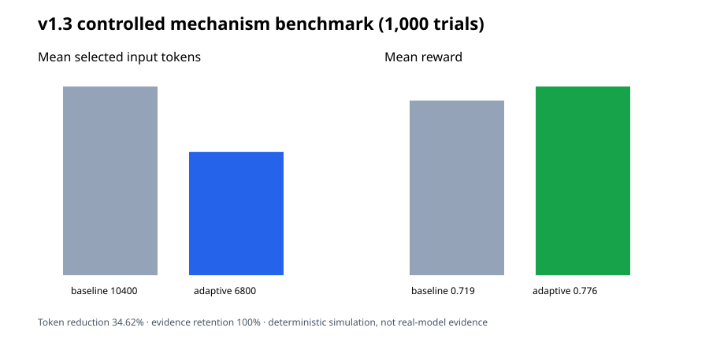

# v1.3 研究融合与试验结果

日期：2026-09-25

## 融合的方法

1. **LongLLMLingua / LLMLingua 思路**：实现查询感知的片段级筛选，保护指令、结构边界和显式 `must_keep` 证据。当前是透明、无依赖的抽取式近似，不宣称复现其神经压缩器。
2. **Prompt caching / prefix caching**：输出稳定前缀与动态后缀布局；稳定的指令、工具定义和 schema 应位于前部，变化内容置后。
3. **FrugalGPT / RouteLLM 思路**：提供低成本动作到更强 profile 的质量/失败级联。为避免不可控的二次费用，执行必须显式设置 `enable_cascade`。
4. **Contextual bandit 安全学习**：保留对角 LinUCB、epsilon 探索和漂移衰减，并新增质量下界、失败率、延迟闸门。
5. **离线策略评估**：根据日志 propensity 实现 IPS、SNIPS 与 Doubly Robust，并报告有效样本量和最大重要性权重。

## 受控试验

命令：

```bash
python3 -m unittest -v test_elastic_budget_controller.py test_off_policy_eval.py
python3 benchmarks/compare_v13.py
python3 benchmarks/simulate_online_learning.py --requests 1000 \
  --output benchmarks/results/2026-09-25/v1.3-online-learning.json
```

结果：

- 33 项单元/集成测试通过；
- 1,000 次上下文筛选受控试验：平均输入片段 token 从 10,400 降到 6,800，下降 34.62%；目标证据保留率 100%；
- 同一模拟奖励函数下：基线平均奖励 0.718667，弹性方案 0.776073；
- 1,000 请求闭环学习模拟：弹性平均奖励 0.091227，固定 standard 为 -0.000522。



## 证据边界

这些结果是确定性机制试验，验证筛选器、策略学习、约束和统计实现是否按设计工作，不是第三方真实模型质量或美元费用证据。真实部署仍需固定输入、grader、模型版本、价格快照和足量随机化流量；随后用本版 propensity 日志进行 IPS/SNIPS/DR 分析。

## 来源项目与方法

- Microsoft LLMLingua / LongLLMLingua：上下文压缩和查询感知选择；
- LMSYS RouteLLM：在质量和成本间进行模型路由；
- FrugalGPT：级联调用与成本质量优化；
- Vowpal Wabbit contextual bandits：在线探索、propensity 与反事实评估；
- vLLM prefix caching：稳定共享前缀复用；
- OpenAI Prompt Caching 与 Evals/Graders：缓存布局和显式质量反馈。

参考链接：

- https://github.com/microsoft/LLMLingua
- https://github.com/lm-sys/RouteLLM
- https://github.com/stanford-futuredata/FrugalGPT
- https://vowpalwabbit.org/docs/vowpal_wabbit/python/latest/tutorials/python_Contextual_bandits_and_Vowpal_Wabbit.html
- https://docs.vllm.ai/en/latest/features/automatic_prefix_caching.html
- https://platform.openai.com/docs/guides/prompt-caching
- https://platform.openai.com/docs/guides/evals

仓库没有复制上述项目代码；实现为标准库兼容的独立接口与算法近似。部署时应继续核对各项目许可证和当前 API 行为。
