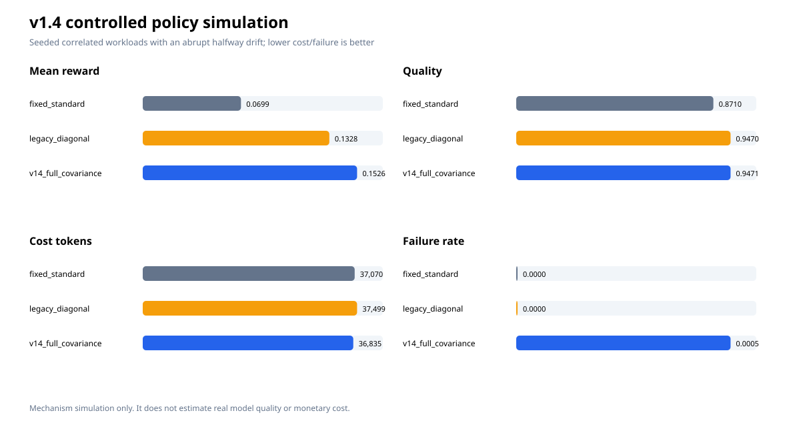

# v1.4：置信约束弹性预算研究与实验

日期：2026-09-26

## 结论

v1.4 把请求路由从对角近似升级为全协方差 LinUCB，并加入质量/失败置信闸门、成本优先冷启动、风险调整探索、选择性级联和按 tier 漂移恢复。2,000 请求机制模拟中，它相对固定 `standard` 提高平均质量 8.73%，成本代理下降 0.63%，延迟下降 4.07%；相对 v1.3 对角学习器，质量基本持平，成本代理下降 1.77%，延迟下降 10.69%。代价是 0.05% 的模拟失败率，而两个对照均为 0，不能隐瞒。

这些数字只验证机制，不是真实模型节省证据。真实 Codex A/B 另存于 [`results/2026-09-26-v1.4/real-ab/REPORT.zh-CN.md`](results/2026-09-26-v1.4/real-ab/REPORT.zh-CN.md)。

## 文献到实现的映射

| 依据 | 可迁移思想 | v1.4 实现 |
|---|---|---|
| Li 等的 LinUCB；Chu 等的线性收益分析 | 用上下文特征、回报估计和置信上界平衡探索/利用 | 保存完整 `A` 矩阵与 `b` 向量，使用 `xᵀA⁻¹x` 置信半径；旧 `a_diagonal` 自动迁移 |
| Kazerouni 等的 Conservative Linear UCB | 探索必须相对安全基线受约束 | Wilson 失败率上界、质量均值下界、延迟闸门；危险 arm 回退基线候选 |
| Lattimore 与 Szepesvári；Sutton 与 Barto | 探索成本、非平稳性和递减探索应显式建模 | 最小样本探索、容量成本先验、随样本衰减且受质量风险抑制的 epsilon |
| Liu、Lee、Shroff 的 PHT/CUSUM-UCB | 非平稳环境要检测变化并重启/衰减过时统计 | Page-Hinkley 风格检测；漂移状态按 tier 隔离，只衰减受影响 tier 的 arm |
| FrugalGPT | 低成本调用先行，仅在质量不足时级联 | 仅在明确失败或高风险质量缺口时升级；低风险缺口不自动产生第二次调用 |
| RouteLLM | 根据请求特征学习质量—成本路由 | complexity、quality risk、token、工具、轮数、延迟敏感、可复用前缀组成路由特征 |
| LLMLingua / LongLLMLingua | 查询感知压缩、保护关键内容、长上下文重排 | 查询相关上下文筛选、保护边界、extractive/semantic 压缩计划；本项目未嵌入其外部模型 |
| OpenAI Prompt Caching | 稳定前缀和动态后缀可降低延迟与输入成本 | 输出稳定前缀/动态后缀布局和 cache mode；记录 cached/cache-write token |
| OpenAI Eval 最佳实践 | 明确目标、任务特定数据、自动评分、持续记录 | 配对交替 A/B、结构化参考答案、原始 JSONL、逐轮答案和超时删失口径 |

## 为什么全协方差很重要

对角近似假定请求特征彼此独立，但复杂度、质量风险、工具数量和轮数通常相关。完整矩阵保留交叉项，使置信区间反映已观测的特征组合。实现仍使用小型 8×8 矩阵和标准库 Gauss-Jordan 求逆，计算成本相对模型调用可忽略；矩阵奇异时安全退回单位阵。

## 置信闸门与冷启动

- 失败率使用 Wilson 上置信界，避免少量零失败样本被误判为绝对安全。
- 质量使用样本均值下置信界，避免偶然高分驱动激进降档。
- 未达到最小样本数时，先试容量最低且仍通过安全闸门的 profile，而不是随机尝试昂贵档位。
- epsilon 随总样本量按平方根衰减，并被 `quality_risk` 抑制；高风险请求更接近确定性安全选择。
- Welford 在线方差避免保存原始反馈，并为质量置信下界提供稳定估计。

## 机制模拟

固定随机种子、2,000 个合成请求，包含请求组合和分布漂移。三个策略使用相同样本流。

| 策略 | 平均质量 | 平均成本代理 token | 平均延迟秒 | 失败率 | 平均 reward |
|---|---:|---:|---:|---:|---:|
| fixed standard | 0.871033 | 37,069.87 | 7.1680 | 0 | 0.069902 |
| legacy diagonal | 0.946957 | 37,498.62 | 7.6996 | 0 | 0.132821 |
| v1.4 full covariance | 0.947065 | 36,834.87 | 6.8766 | 0.0005 | 0.152562 |

共触发 4 次 tier 级漂移检测。负面结果是 v1.4 出现 1 次模拟失败（0.05%）；这说明安全闸门降低风险但没有形式化保证。后续应增加累计基线约束或为高风险流量设置硬性 `standard` 下限。

## 真实 A/B 口径

- baseline 固定 `standard`；adaptive 对每个 case 实时调用 `request_budget`，不是预先写死标签。
- 两组使用同一模型、provider、prompt、schema、工具权限，执行顺序交替。
- 质量按结构化参考答案逐字段计分；失败/超时质量为 0，token、成本代理和延迟均值只统计完成样本。
- adaptive profile 同时改变窗口、压缩阈值、reasoning effort、verbosity 和 summary。因此 A/B 只能归因整套 profile，不能声称是全协方差、压缩或某个参数单独带来的提升。
- 未提供 provider 单价，不报告货币成本；成本代理仅用于同一次实验内部比较。

## 真实 A/B 结果

5 个 case、每组 1 轮，共 10 次真实 Codex CLI 调用，均在 180 秒内完成。冷启动控制器把 5 个 adaptive 请求都选择为 `balanced`。

| 指标 | baseline `standard` | adaptive `balanced` | 相对变化 |
|---|---:|---:|---:|
| 质量均值 | 0.8000 | 1.0000 | +25.00% |
| 总 token 均值 | 14,962.2 | 16,433.2 | +9.83% |
| 成本代理均值 | 15,821.4 | 14,510.2 | -8.29% |
| 延迟均值 | 28.325 秒 | 60.758 秒 | +114.50% |

baseline 的一次 `dependency_analysis` 返回了数值正确但缺少顶层 `answer` 的 JSON，违反统一 schema，因此严格 grader 记 0 分。adaptive 的质量优势主要来自这一次格式失败，样本太小，不能解读为稳定的 25% 提升。更重要的负面信号是 adaptive 平均延迟增加一倍以上，且总 token 增加；成本代理下降主要受 cached token 权重影响。完整证据、答案和原始事件见真实 A/B 目录。

## 尚未直接融合的方案

LLMLingua 系列需要额外压缩模型，会新增运行成本、依赖和语义丢失风险；RouteLLM/FrugalGPT 的完整训练还需要大量人工或偏好标签。当前版本只吸收其可在本地、无额外模型条件下实施的路由、上下文筛选和选择性级联思想。下一阶段应先积累真实、经 grader 校准的 production trace，再评估非线性 router、Doubly Robust 策略选择和显式预算约束。

## 原始资料

- OpenAI Codex configuration reference: https://developers.openai.com/codex/config-reference/
- OpenAI Prompt Caching: https://developers.openai.com/api/docs/guides/prompt-caching
- OpenAI Evaluation best practices: https://developers.openai.com/api/docs/guides/evaluation-best-practices
- Li et al., *A Contextual-Bandit Approach to Personalized News Article Recommendation* (2010): https://arxiv.org/abs/1003.0146
- Chu et al., *Contextual Bandits with Linear Payoff Functions* (2011): https://www.schapire.net/papers/bandit-lin.pdf
- Kazerouni et al., *Conservative Contextual Linear Bandits* (NeurIPS 2017): https://papers.nips.cc/paper_files/paper/2017/file/bdc4626aa1d1df8e14d80d345b2a442d-Paper.pdf
- Liu, Lee, Shroff, *A Change-Detection Based Framework for Piecewise-Stationary Multi-Armed Bandit Problem* (AAAI 2018): https://ojs.aaai.org/index.php/AAAI/article/view/11746
- Chen, Zaharia, Zou, *FrugalGPT* (TMLR 2024): https://arxiv.org/abs/2305.05176
- Ong et al., *RouteLLM* (2024): https://arxiv.org/abs/2406.18665
- Jiang et al., *LLMLingua* (EMNLP 2023): https://aclanthology.org/2023.emnlp-main.825/
- Jiang et al., *LongLLMLingua* (2023): https://arxiv.org/abs/2310.06839
- Lattimore & Szepesvári, *Bandit Algorithms* (2020): https://tor-lattimore.com/downloads/book/book.pdf
- Sutton & Barto, *Reinforcement Learning: An Introduction*, 2nd ed. (2018): https://mitpress.mit.edu/9780262039246/reinforcement-learning/
