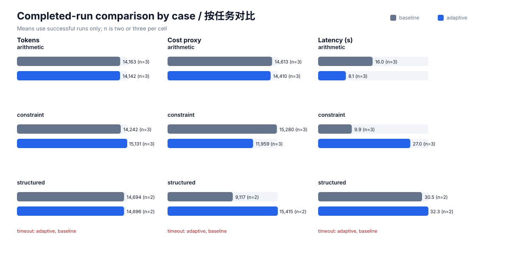
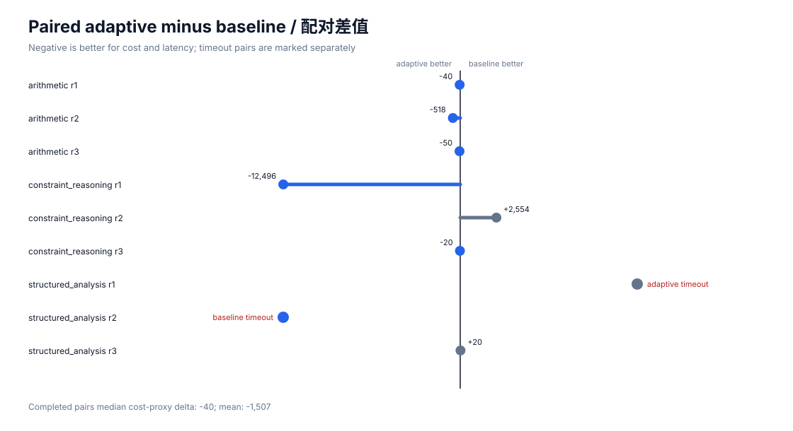

# A/B 实验结果

- 日期：2026-09-25T12:17:37.542810+00:00
- Codex CLI：codex-cli 0.155.0-alpha.16.4
- 模型与 provider：与本机配置保持一致，未写入仓库
- 轮数：每个 case 每组 3 轮
- 总试验数：18
- 真实货币费用：未报告；provider 单价未知

## 汇总

| 指标 | 固定配置 baseline | 弹性 adaptive | 相对变化 |
|---|---:|---:|---:|
| 质量分数（均值） | 0.8889 | 0.8889 | 0.0% |
| 总 token（完成样本均值） | 14325.5 | 14651.5 | 2.28% |
| 成本代理值（完成样本均值） | 13489.1 | 13742.4 | 1.88% |
| 延迟秒数（完成样本均值） | 17.314 | 21.267 | 22.83% |
| 成功率 | 88.89% | 88.89% | — |
| 超时次数 | 1 | 1 | — |

质量仍将超时记为 0；资源和延迟均值只使用完成样本，并在 `summary.json` 记录 `n`。超时是右删失观测，不应伪装成 0 token 或 0 成本。

## 按任务分解

| Case | baseline 质量 | adaptive 质量 | baseline token | adaptive token | 超时 baseline/adaptive |
|---|---:|---:|---:|---:|---:|
| arithmetic | 1.0000 | 1.0000 | 14163.0 | 14142.3 | 0 / 0 |
| constraint_reasoning | 1.0000 | 1.0000 | 14242.0 | 15130.7 | 0 / 0 |
| structured_analysis | 0.6667 | 0.6667 | 14694.5 | 14696.5 | 1 / 1 |

## Pairwise

- baseline 胜：3
- adaptive 胜：6
- 平局：0

同一 case、同一轮先比较质量；质量相同时优先完成状态，再比较成本代理值。

## 证据文件

- `trials.jsonl`：逐轮结构化指标；
- `summary.json`：统计汇总；
- `raw/`：Codex JSONL 原始事件；
- `answers/`：模型最终结构化答案；
- `metadata.json`：运行环境和口径。

## 解释边界

这是一组小样本、同模型、固定输入的回归实验。它可以证明脚本和评测流程可复现，并展示特定任务上的质量/成本变化，但不能证明对所有真实任务普遍更优。本轮结果显示 adaptive 并未降低总体平均 token 或延迟，后续学习器应把这组结果作为负反馈，而不是宣称优化成功。
