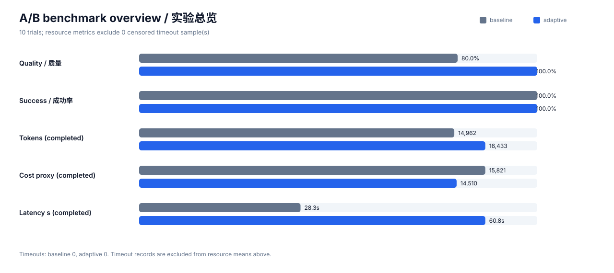
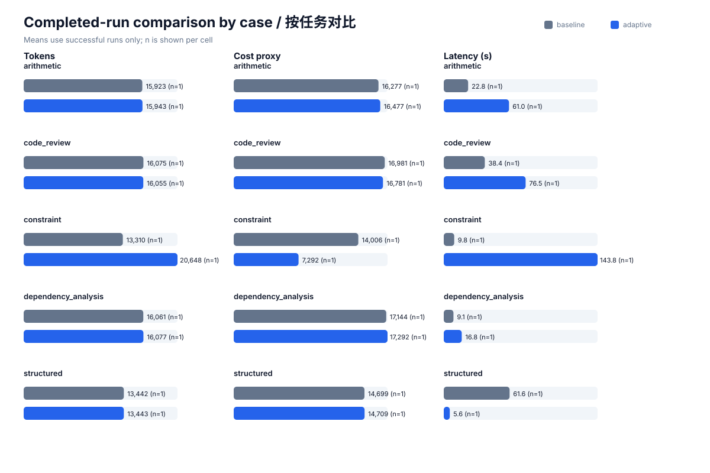
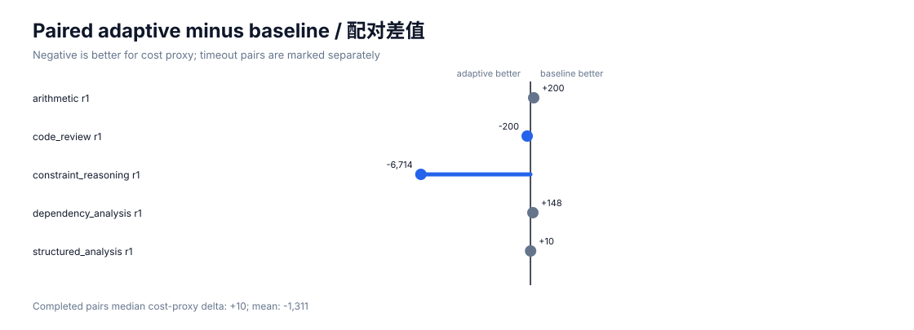

# A/B 实验结果

- 日期：2026-09-25T16:33:58.083281+00:00
- Codex CLI：codex-cli 0.155.0-alpha.16.4
- 模型与 provider：与本机配置保持一致，未写入仓库
- 轮数：每个 case 每组 1 轮
- 总试验数：10
- 真实货币费用：未报告；provider 单价未知

## 汇总

| 指标 | 固定配置 baseline | 弹性 adaptive | 相对变化 |
|---|---:|---:|---:|
| 质量分数（均值） | 0.8000 | 1.0000 | 25.0% |
| 总 token（完成样本均值） | 14962.2 | 16433.2 | 9.83% |
| 成本代理值（完成样本均值） | 15821.4 | 14510.2 | -8.29% |
| 延迟秒数（完成样本均值） | 28.325 | 60.758 | 114.5% |
| 成功率 | 100.00% | 100.00% | — |
| 超时次数 | 0 | 0 | — |

质量仍将超时记为 0；资源和延迟均值只使用完成样本，并在 `summary.json` 记录 `n`。超时是右删失观测，不应伪装成 0 token 或 0 成本。

## 按任务分解

| Case | baseline 质量 | adaptive 质量 | baseline token | adaptive token | 超时 baseline/adaptive |
|---|---:|---:|---:|---:|---:|
| arithmetic | 1.0000 | 1.0000 | 15923.0 | 15943.0 | 0 / 0 |
| code_review | 1.0000 | 1.0000 | 16075.0 | 16055.0 | 0 / 0 |
| constraint_reasoning | 1.0000 | 1.0000 | 13310.0 | 20648.0 | 0 / 0 |
| dependency_analysis | 0.0000 | 1.0000 | 16061.0 | 16077.0 | 0 / 0 |
| structured_analysis | 1.0000 | 1.0000 | 13442.0 | 13443.0 | 0 / 0 |

## Pairwise

- baseline 胜：2
- adaptive 胜：3
- 平局：0

同一 case、同一轮先比较质量；质量相同时优先完成状态，再比较成本代理值。

## 证据文件

- `trials.jsonl`：逐轮结构化指标；
- `summary.json`：统计汇总；
- `raw/`：Codex JSONL 原始事件；
- `answers/`：模型最终结构化答案；
- `metadata.json`：运行环境和口径。

## 解释边界

这是一组小样本、同模型、固定输入的回归实验。adaptive 档位由控制器在每个请求执行前基于输入特征实时选择，而 baseline 固定为 `standard`。profile 会同时改变上下文窗口、压缩阈值、推理强度、详细度和推理摘要，因此差异只能归因于整套 profile，不可归因于单一参数或学习器组件。结果只说明这些固定任务上的表现，不能证明对所有真实任务普遍更优。
