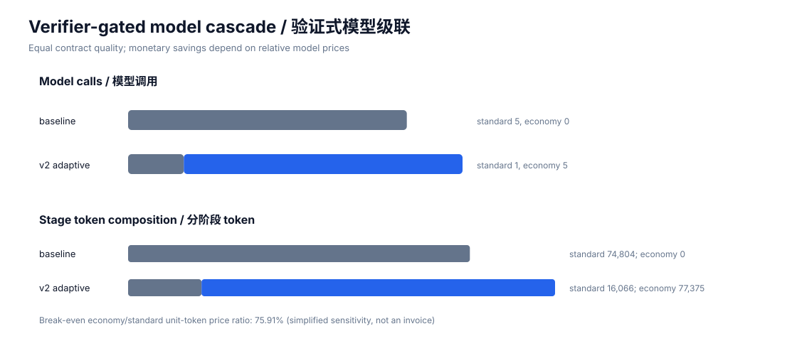
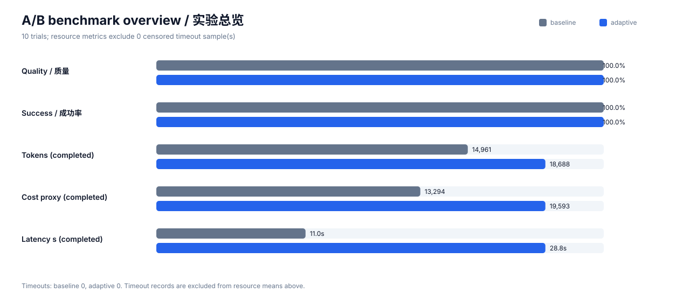
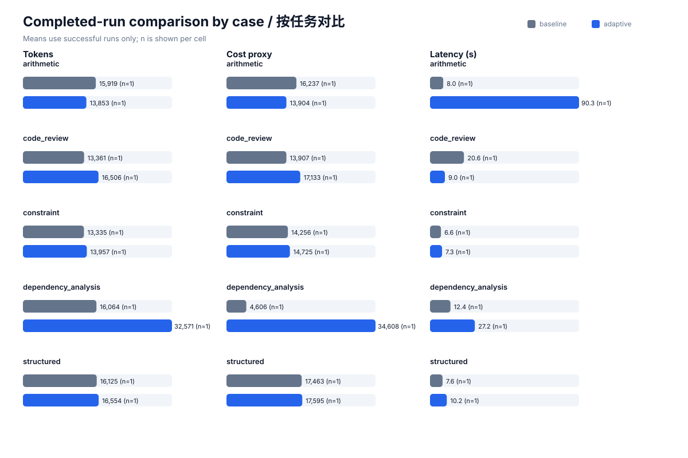
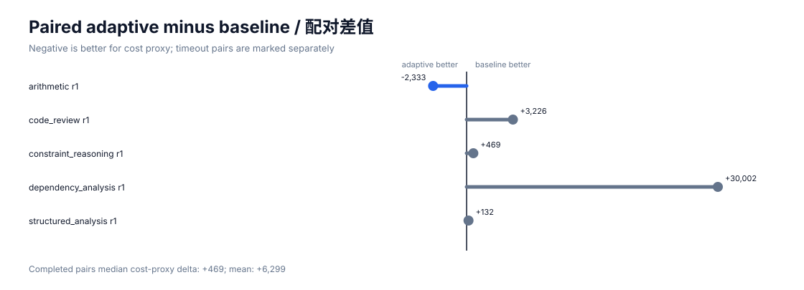
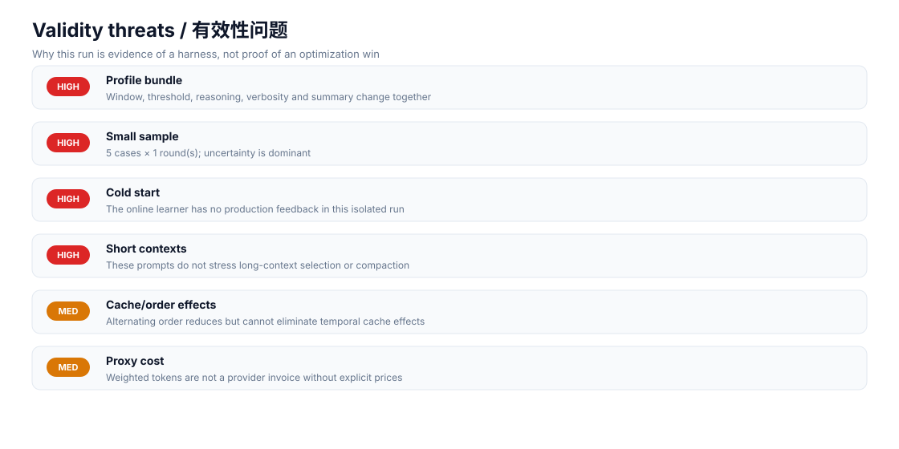

# v2 真实 A/B 实验结果

- 日期：2026-09-25T17:03:08.520627+00:00
- Codex CLI：codex-cli 0.155.0-alpha.16.4
- baseline 标准模型：沿用本机配置，具体名称未写入仓库
- v2 廉价阶段模型：`gpt-6-sol`；失败时回退本机标准模型
- 轮数：每个 case 每组 1 轮
- 总试验数：10
- 对照：完全不使用成本控制，固定 `standard` 单次执行
- v2：廉价模型 `economy` 首次执行；外部确定性契约不通过才升级标准模型
- v2 升级次数：1/5
- 真实货币费用：未报告；provider 单价未知

## 汇总

| 指标 | 无控制 baseline | v2 验证式渐进推理 | 相对变化 |
|---|---:|---:|---:|
| 质量分数（均值） | 1.0000 | 1.0000 | 0.0% |
| 总 token（完成样本均值） | 14960.8 | 18688.2 | 24.91% |
| 成本代理值（完成样本均值） | 13293.8 | 19593.0 | 47.38% |
| 延迟秒数（完成样本均值） | 11.042 | 28.792 | 160.75% |
| 成功率 | 100.00% | 100.00% | — |
| 超时次数 | 0 | 0 | — |

质量仍将超时记为 0；资源和延迟均值只使用完成样本，并在 `summary.json` 记录 `n`。本轮 token 代理和延迟都变差，不能据此宣称总体成本下降。

## 模型级联结果

- 标准模型调用：5 → 1，减少 80%；
- 廉价模型调用：5；其中 4 次通过契约后直接停止，1 次升级；
- 标准模型 token：baseline 74,804，v2 升级阶段 16,066；廉价阶段 77,375；
- 简化盈亏平衡：若廉价模型的单位 token 价格低于标准模型的 75.91%，按本轮 token 总量才可能产生价格优势。该比例忽略不同 token 类型、缓存折扣和固定费用，只是敏感性边界，不是账单。

## 按任务分解

| Case | baseline 质量 | v2 质量 | baseline token | v2 token | 超时 baseline/v2 |
|---|---:|---:|---:|---:|---:|
| arithmetic | 1.0000 | 1.0000 | 15919.0 | 13853.0 | 0 / 0 |
| code_review | 1.0000 | 1.0000 | 13361.0 | 16506.0 | 0 / 0 |
| constraint_reasoning | 1.0000 | 1.0000 | 13335.0 | 13957.0 | 0 / 0 |
| dependency_analysis | 1.0000 | 1.0000 | 16064.0 | 32571.0 | 0 / 0 |
| structured_analysis | 1.0000 | 1.0000 | 16125.0 | 16554.0 | 0 / 0 |

## Pairwise

- baseline 胜：4
- v2 胜：1
- 平局：0

同一 case、同一轮先比较质量；质量相同时优先完成状态，再比较成本代理值。

## 证据文件

- `trials.jsonl`：逐轮结构化指标和每次升级路径；
- `summary.json`：统计汇总；
- `raw/`：Codex JSONL 原始事件；
- `answers/`：各阶段结构化答案；
- `metadata.json`：运行环境和口径。

## 解释边界

这是小样本、固定输入的模型级联回归实验。v2 的质量判断来自执行后外部契约，而不是模型自评；但本 benchmark 的参考答案是强 oracle，只能代表可自动验证任务。成本代理只衡量 token 类型，不含不同模型的实际单价差，因此它是保守的算力口径，不是账单。开放式写作、主观评价或契约覆盖不足的任务必须直接使用标准模型，不能据此承诺质量不下降。
