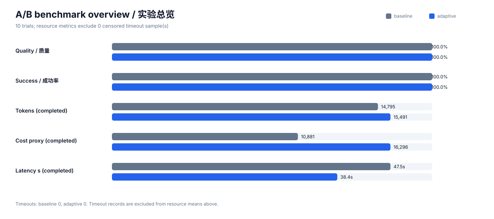
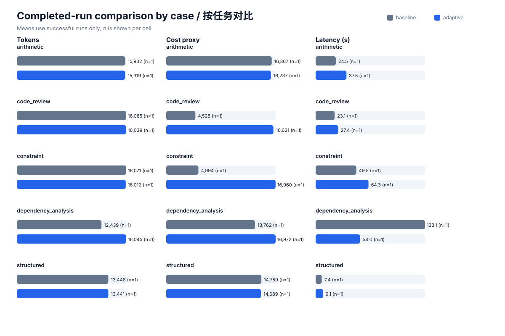
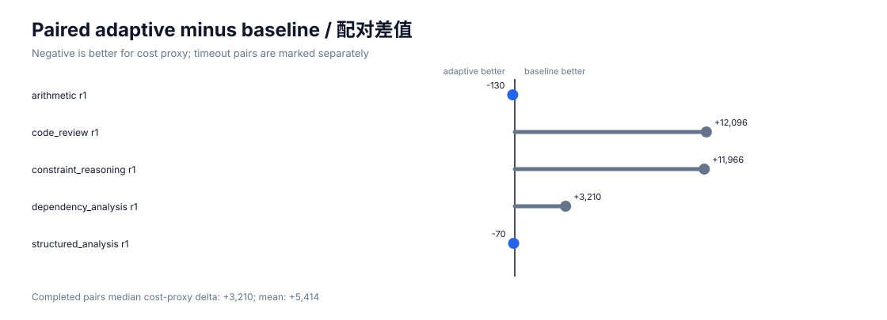

# v2 真实 A/B 实验结果

- 日期：2026-09-25T16:54:56.747699+00:00
- Codex CLI：codex-cli 0.155.0-alpha.16.4
- 模型与 provider：与本机配置保持一致，未写入仓库
- 轮数：每个 case 每组 1 轮
- 总试验数：10
- 对照：完全不使用成本控制，固定 `standard` 单次执行
- v2：`economy` 首次执行；外部确定性契约不通过才升级 `standard`
- v2 升级次数：0/5
- 真实货币费用：未报告；provider 单价未知

## 汇总

| 指标 | 无控制 baseline | v2 验证式渐进推理 | 相对变化 |
|---|---:|---:|---:|
| 质量分数（均值） | 1.0000 | 1.0000 | 0.0% |
| 总 token（完成样本均值） | 14795.0 | 15491.2 | 4.71% |
| 成本代理值（完成样本均值） | 10881.4 | 16295.8 | 49.76% |
| 延迟秒数（完成样本均值） | 47.521 | 38.449 | -19.09% |
| 成功率 | 100.00% | 100.00% | — |
| 超时次数 | 0 | 0 | — |

质量仍将超时记为 0；资源和延迟均值只使用完成样本，并在 `summary.json` 记录 `n`。

## 按任务分解

| Case | baseline 质量 | v2 质量 | baseline token | v2 token | 超时 baseline/v2 |
|---|---:|---:|---:|---:|---:|
| arithmetic | 1.0000 | 1.0000 | 15932.0 | 15919.0 | 0 / 0 |
| code_review | 1.0000 | 1.0000 | 16085.0 | 16039.0 | 0 / 0 |
| constraint_reasoning | 1.0000 | 1.0000 | 16071.0 | 16012.0 | 0 / 0 |
| dependency_analysis | 1.0000 | 1.0000 | 12439.0 | 16045.0 | 0 / 0 |
| structured_analysis | 1.0000 | 1.0000 | 13448.0 | 13441.0 | 0 / 0 |

## Pairwise

- baseline 胜：3
- v2 胜：2
- 平局：0

同一 case、同一轮先比较质量；质量相同时优先完成状态，再比较成本代理值。

## 证据文件

- `trials.jsonl`：逐轮结构化指标和每次升级路径；
- `summary.json`：统计汇总；
- `raw/`：Codex JSONL 原始事件；
- `answers/`：各阶段结构化答案；
- `metadata.json`：运行环境和口径。

## 解释边界

这是小样本、同模型、固定输入的回归实验。v2 的质量判断来自执行后外部契约，而不是模型自评；但本 benchmark 的参考答案是强 oracle，只能代表可自动验证任务。开放式写作、主观评价或契约覆盖不足的任务必须直接使用 `standard`，不能据此承诺质量不下降。
